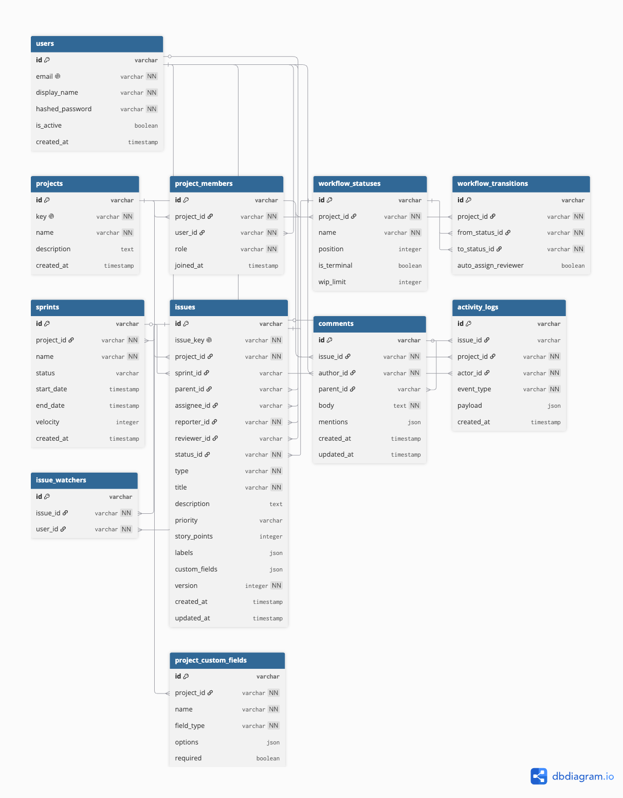

# Database Schema & Entity Relationship Diagram

## ER Diagram



---

## Core Tables

### `users`
```sql
CREATE TABLE users (
  id VARCHAR PRIMARY KEY,
  email VARCHAR UNIQUE NOT NULL,
  display_name VARCHAR NOT NULL,
  hashed_password VARCHAR NOT NULL,
  is_active BOOLEAN DEFAULT TRUE,
  created_at TIMESTAMP DEFAULT NOW()
);
```

**Indexes**: email (unique)

---

### `projects`
```sql
CREATE TABLE projects (
  id VARCHAR PRIMARY KEY,
  key VARCHAR(10) UNIQUE NOT NULL,
  name VARCHAR NOT NULL,
  description TEXT,
  created_at TIMESTAMP DEFAULT NOW()
);
```

**Indexes**: key (unique)

---

### `project_members`
```sql
CREATE TABLE project_members (
  id VARCHAR PRIMARY KEY,
  project_id VARCHAR NOT NULL REFERENCES projects(id),
  user_id VARCHAR NOT NULL REFERENCES users(id),
  role ENUM('admin', 'project_lead', 'member', 'viewer') DEFAULT 'member',
  joined_at TIMESTAMP DEFAULT NOW(),
  UNIQUE(project_id, user_id)
);
```

**Relationship**: Many-to-many between users and projects with role

---

### `workflow_statuses`
```sql
CREATE TABLE workflow_statuses (
  id VARCHAR PRIMARY KEY,
  project_id VARCHAR NOT NULL REFERENCES projects(id),
  name VARCHAR NOT NULL,
  position INTEGER DEFAULT 0,
  is_terminal BOOLEAN DEFAULT FALSE,
  wip_limit INTEGER
);
```

**Relationships**: 
- Each project has 4+ statuses (To Do, In Progress, In Review, Done)
- Configurable per project
- Positions determine board column order

---

### `workflow_transitions`
```sql
CREATE TABLE workflow_transitions (
  id VARCHAR PRIMARY KEY,
  project_id VARCHAR NOT NULL REFERENCES projects(id),
  from_status_id VARCHAR NOT NULL REFERENCES workflow_statuses(id),
  to_status_id VARCHAR NOT NULL REFERENCES workflow_statuses(id),
  auto_assign_reviewer BOOLEAN DEFAULT FALSE
);
```

**Relationships**: Defines allowed transitions per project

---

### `issues`
```sql
CREATE TABLE issues (
  id VARCHAR PRIMARY KEY,
  issue_key VARCHAR UNIQUE NOT NULL,
  project_id VARCHAR NOT NULL REFERENCES projects(id),
  sprint_id VARCHAR REFERENCES sprints(id),
  parent_id VARCHAR REFERENCES issues(id),
  assignee_id VARCHAR REFERENCES users(id),
  reporter_id VARCHAR NOT NULL REFERENCES users(id),
  reviewer_id VARCHAR REFERENCES users(id),
  status_id VARCHAR NOT NULL REFERENCES workflow_statuses(id),
  
  type ENUM('epic', 'story', 'task', 'bug', 'subtask') NOT NULL,
  title VARCHAR NOT NULL,
  description TEXT,
  priority ENUM('low', 'medium', 'high', 'critical') DEFAULT 'medium',
  story_points INTEGER,
  labels JSON DEFAULT '[]',
  custom_fields JSON DEFAULT '{}',
  
  version INTEGER DEFAULT 1 NOT NULL,
  created_at TIMESTAMP DEFAULT NOW(),
  updated_at TIMESTAMP DEFAULT NOW()
);

CREATE INDEX ix_issues_project_id ON issues(project_id);
CREATE INDEX ix_issues_sprint_id ON issues(sprint_id);
CREATE INDEX ix_issues_status_id ON issues(status_id);
CREATE INDEX ix_issues_assignee_id ON issues(assignee_id);
```

**Key Features**:
- `version`: Optimistic locking
- `parent_id`: Self-referencing for Epic → Story → Subtask hierarchy
- `custom_fields`: JSON for flexible per-project extensions
- Indexes on high-cardinality foreign keys

---

### `sprints`
```sql
CREATE TABLE sprints (
  id VARCHAR PRIMARY KEY,
  project_id VARCHAR NOT NULL REFERENCES projects(id),
  name VARCHAR NOT NULL,
  status ENUM('planned', 'active', 'completed') DEFAULT 'planned',
  start_date TIMESTAMP,
  end_date TIMESTAMP,
  velocity INTEGER DEFAULT 0,
  created_at TIMESTAMP DEFAULT NOW()
);
```

**Relationships**: One sprint is active per project at a time

---

### `comments`
```sql
CREATE TABLE comments (
  id VARCHAR PRIMARY KEY,
  issue_id VARCHAR NOT NULL REFERENCES issues(id),
  author_id VARCHAR NOT NULL REFERENCES users(id),
  parent_id VARCHAR REFERENCES comments(id),
  body TEXT NOT NULL,
  mentions JSON DEFAULT '[]',
  created_at TIMESTAMP DEFAULT NOW(),
  updated_at TIMESTAMP DEFAULT NOW()
);
```

**Features**:
- `parent_id`: Threading (reply to comment)
- `mentions`: Array of user_ids mentioned

---

### `activity_logs`
```sql
CREATE TABLE activity_logs (
  id VARCHAR PRIMARY KEY,
  issue_id VARCHAR REFERENCES issues(id),
  project_id VARCHAR NOT NULL REFERENCES projects(id),
  actor_id VARCHAR NOT NULL REFERENCES users(id),
  event_type VARCHAR NOT NULL,
  payload JSON DEFAULT '{}',
  created_at TIMESTAMP DEFAULT NOW()
);

CREATE INDEX ix_activity_project_created ON activity_logs(project_id, created_at DESC);
```

**Audit Trail**: Every mutation recorded
- `event_type`: issue_created, status_changed, sprint_carry_over, etc.
- `payload`: Before/after values, rule application, etc.

---

### `issue_watchers`
```sql
CREATE TABLE issue_watchers (
  id VARCHAR PRIMARY KEY,
  issue_id VARCHAR NOT NULL REFERENCES issues(id),
  user_id VARCHAR NOT NULL REFERENCES users(id),
  UNIQUE(issue_id, user_id)
);
```

**Relationships**: Many-to-many between users and issues (subscriptions)

---

### `project_custom_fields`
```sql
CREATE TABLE project_custom_fields (
  id VARCHAR PRIMARY KEY,
  project_id VARCHAR NOT NULL REFERENCES projects(id),
  name VARCHAR NOT NULL,
  field_type ENUM('text', 'number', 'dropdown', 'date') NOT NULL,
  options JSON DEFAULT '[]',
  required BOOLEAN DEFAULT FALSE,
  UNIQUE(project_id, name)
);
```

**Relationships**: Schema definitions per project, values stored in issues.custom_fields

---

## Relationships Summary

| Relationship | Type | Notes |
|---|---|---|
| User ↔ Project | M:M | Through project_members with role |
| Project → Issue | 1:M | One project has many issues |
| Issue → Issue | 1:M | Parent-child (epic/story/subtask) |
| Project → Sprint | 1:M | One project has many sprints |
| Sprint → Issue | 1:M | Issues assigned to sprint (optional) |
| Issue → User | M:M | Assignee, reporter, reviewer |
| Issue → Comment | 1:M | Threaded comments |
| Comment → Comment | 1:M | Nested replies |
| Issue → Watcher | M:M | Subscriptions |
| Project → Status | 1:M | Workflow columns |
| Status → Transition | 1:M | Allowed transitions |

---

## Constraints & Indexes

### Primary Keys
All tables use `VARCHAR` for IDs (generated UUIDs)

### Foreign Keys
All foreign keys have `NOT NULL` except optional fields (sprint_id, parent_id, etc.)

### Unique Constraints
```sql
-- Users
UNIQUE(email)

-- Projects
UNIQUE(key)

-- Project Members
UNIQUE(project_id, user_id)

-- Issues
UNIQUE(issue_key)

-- Custom Fields
UNIQUE(project_id, name)

-- Issue Watchers
UNIQUE(issue_id, user_id)
```

### Indexes (High-Cardinality Lookups)
```sql
-- Issues queries
CREATE INDEX ix_issues_project_id ON issues(project_id);
CREATE INDEX ix_issues_sprint_id ON issues(sprint_id);
CREATE INDEX ix_issues_status_id ON issues(status_id);
CREATE INDEX ix_issues_assignee_id ON issues(assignee_id);

-- Activity feed (project + time range)
CREATE INDEX ix_activity_project_created ON activity_logs(project_id, created_at DESC);
```

### Full-Text Search
```sql
-- PostgreSQL GiST index on issue title + description
CREATE INDEX ix_issues_fulltext ON issues 
  USING GiST(to_tsvector('english', title || ' ' || COALESCE(description, '')));
```

---

## Integrity Constraints

### Workflow Rules
- `workflow_transitions` defines valid paths
- Transition validation enforced in application layer

### Optimistic Locking
- Every issue has `version` field
- Updates must match current version or fail with 409

### WIP Limits
- `workflow_statuses.wip_limit` (nullable)
- Enforced in application layer with advisory locks

### Referential Integrity
- All foreign keys cascade on delete where appropriate
- Soft deletes via is_active flag (if needed in future)

---

## Query Performance Notes

### Board Query (Optimized)
```sql
-- 1. Statuses
SELECT * FROM workflow_statuses 
WHERE project_id = ? 
ORDER BY position

-- 2. Active Sprint
SELECT * FROM sprints 
WHERE project_id = ? AND status = 'active'

-- 3. All Issues (single query, no N+1)
SELECT * FROM issues WHERE project_id = ?

-- Application layer groups by status_id in memory
```

### Activity Feed (Paginated)
```sql
SELECT * FROM activity_logs 
WHERE project_id = ? 
ORDER BY created_at DESC 
LIMIT 51
-- Cursor: base64(created_at) for next page
```

### Search (Full-Text)
```sql
SELECT * FROM issues 
WHERE project_id = ? 
AND to_tsvector('english', title || description) @@ plainto_tsquery(?)
ORDER BY created_at DESC
```

---

## Storage Estimates

At 1M issues / 10M comments / 100M activity logs:

| Table | Rows | Size |
|-------|------|------|
| issues | 1M | ~1GB |
| comments | 10M | ~2GB |
| activity_logs | 100M | ~8GB |
| Other | | ~1GB |
| **Total** | | **~12GB** |

Index size: ~3GB
Cache (Redis): ~1GB

---

## Backup Strategy

- PostgreSQL: Daily automated snapshots (AWS RDS)
- Point-in-time recovery: 7-day retention
- Redis: No backup needed (non-authoritative)
