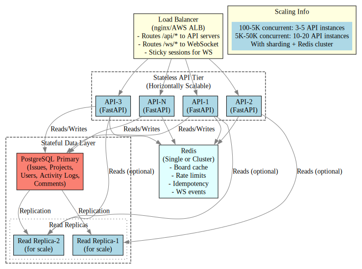

# Horizontal Scaling Strategy

## Architecture Overview

The system is designed to scale horizontally with a clear separation of stateless and stateful components.



## Stateless vs. Stateful

### Stateless (Horizontally Scalable)

- **All API handlers** (`GET /api/v1/issues`, `POST /api/v1/projects`, etc.)
  - Each request is independent; no in-memory state
  - Requests can be routed to any API server
  - Scale: Add more API instances as needed

- **WebSocket connections** (with caveats)
  - Each WebSocket connection is independent
  - BUT: Client must reconnect if that server dies
  - Mitigation: Clients include `last_seen_event_id` in reconnect so they can replay missed events from `EVENT_HISTORY_LOG`

### Stateful (Shared Infrastructure)

- **PostgreSQL**
  - Single source of truth for all persistent data
  - Use standard replication (one primary, N read replicas)
  - API servers connect to primary for writes; can read from replicas if you implement read routing

- **Redis**
  - Board cache (`board:{project_id}`)
  - Idempotency response cache (`idempotency:{key}`)
  - Rate limit counters: `ratelimit:{user_id}`, `ratelimit:ip:{ip_address}`
  - Shared state — all API servers see the same cached values

- **WebSocket Event History**
  - `EVENT_HISTORY_LOG` is an in-memory deque in each server process
  - This is OK for a single deployment, but doesn't scale to multi-server
  - Fix for multi-server: Store last 500 events in Redis under `ws:events` instead
  - Clients can request replay from Redis on reconnect

## Scaling Recommendations

### For 500–5000 concurrent users:

1. **Run 3–5 API instances** (stateless, easy scaling)
   - Typical load: ~500–1000 req/s per instance
   - Use load balancer (nginx, HAProxy, AWS ALB) with round-robin

2. **PostgreSQL: 1 primary + 1 read replica**
   - Monitor connection pool usage; tune `pool_size` and `max_overflow` based on number of API instances
   - Example: 5 instances × 20 pool_size = 100 concurrent connections

3. **Redis: 1 instance** (or cluster for higher throughput)
   - Cache hit rate for boards should be ~80–90% if TTL is tuned right
   - Monitoring: Track cache hit/miss ratio

4. **WebSocket: Co-located with API instances** OR **separate tier**
   - Option A (Simple): Route WS to the same instances as HTTP
   - Option B (Isolated): Separate WS tier with only `GET /ws/board/{project_id}`
   - Load balancer must use sticky sessions for WS (route by client IP)

### For 5000–50,000 concurrent users:

1. **API instances: 10–20** (continue scaling horizontally)

2. **PostgreSQL sharding** (if single primary becomes bottleneck)
   - Shard by `project_id` or `organization_id`
   - Each shard has its own primary + replicas
   - Router layer selects the right shard for each request

3. **Redis cluster** instead of single instance
   - Partitioned by cache key to avoid single point of failure
   - Ensure replication is configured (not just cluster)

4. **WebSocket: Dedicated tier**
   - Use message queue (Redis pub/sub or RabbitMQ) to broadcast events across WS servers
   - When API server issues a mutation, publish to `ws:events:{project_id}` channel
   - All WS servers listening on that channel broadcast to their clients

## Implementation Checklist

- **Load balancer**: Nginx/HAProxy pointing to API instances
- **Connection pooling**: Tune `pool_size`, `max_overflow` per number of instances
- **WebSocket event history**: Move from in-memory deque to Redis
- **Redis pub/sub for WS broadcasts**: Replace direct manager calls with queue publishing
- **Read-only replicas**: Add read routing to `BoardReadModel` and search queries
- **Monitoring**: Track DB connection count, Redis key count, WS connection count per instance
- **Circuit breaker**: Notifications already have one; extend to database failures
- **Graceful drain**: Already implemented; test during rolling deploy

## Testing Scaling

Use the k6 load test to verify the system handles the target load:

```bash
# Simulate 100 concurrent users
k6 run tests/load_test.js --vus 100 --duration 5m
```

Watch metrics:
- `http_req_duration` (p95 should stay < 500ms)
- `errors` (error rate should stay < 1%)
- Database connection count (should not exceed `pool_size + max_overflow`)
- Redis memory (should stay < 50% of total allocated)

## Disaster Recovery

- **Database**: Configure automated backups + point-in-time recovery
- **Redis**: No persistence required (cache is non-authoritative; loss is OK)
- **WebSocket events**: Events live in Redis for 30s; longer history in PostgreSQL activity_logs

## Summary

| Component | Scaling Model | Limit | Fix |
|-----------|---------------|-------|-----|
| API | Stateless; horizontal | 50K req/s per region | Add instances |
| Database | Single primary + replicas | ~5K writes/s | Shard by project_id |
| Redis | Single node (or cluster) | 100K ops/s | Switch to cluster mode |
| WebSocket | In-memory (per server) | N/A (stateless) | Move event history to Redis |
